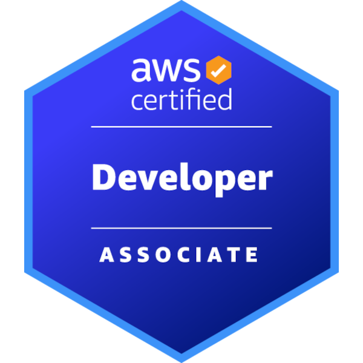
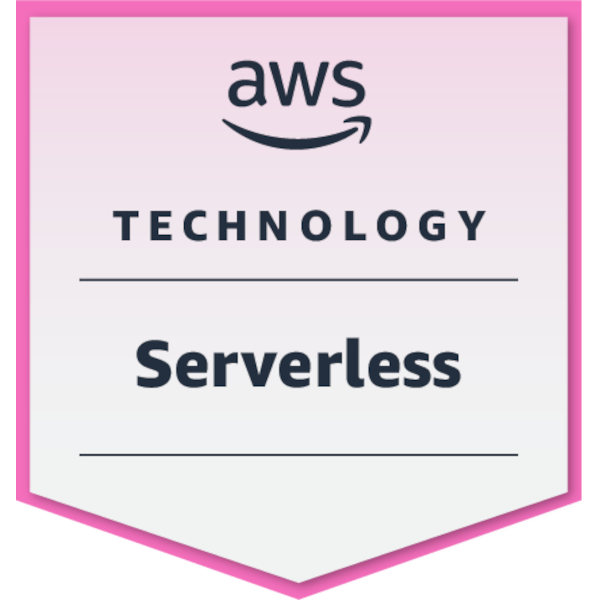

### About Me

```kotlin
data class Tyrannoseanus(
    val name: String = "Sean O'Toole",
    val location: String = "United Kingdom",
    val fakeJobTitle: String = "Lead Software Engineer",
    val officialJobTitle: String = "Software Development Engineer IV",
    val interests: List<String> = listOf(
        "Lego",
        "Dinosaurs",
        "Video games",
        "Lego dinosaur video games",
        "Writing software"
    ),    
    val websites: List<URL> = listOf(
        URL("https://developmentanddinosaurs.co.uk"),
        URL("https://poker.developmentanddinosaurs.co.uk"),
        URL("https://agilekatas.co.uk"),
    )
)
```

### Totally Important Stats

 

### Even More Important Certifications

<p float="left">
  <a href="https://www.credly.com/earner/earned/badge/56bd1074-3c80-4b3e-89de-ef6c1312de2b"></a>
  <a href="https://www.credly.com/earner/earned/badge/5ba81ec6-35b2-4dfc-a6c6-9b17746c64f8"></a>
  <a href="https://www.credly.com/earner/earned/badge/5f45eecf-d35c-44ed-978c-a7734bd003f2"></a>
  <a href="https://tyrannoseanus.github.io/Tyrannoseanus/certificates/dinosaur-paleobiology.pdf"></a>
</p>
